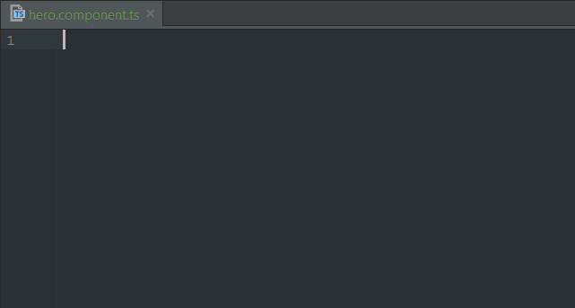

# Angular 2 TypeScript Snippets for WebStorm

John Papa's Angular 2 snippets for WebStorm.
Migrated from [here](https://github.com/johnpapa/vscode-angular2-snippets).



## Usage

Type part of a snippet, press `enter`, and the snippet unfolds.

### TypeScript Snippets

```typescript
ng2-component-root  // Angular 2 root App component
ng2-bootstrap       // Angular 2 bootstraping, for main.ts
ng2-component       // Angular 2 component
ng2-pipe            // Angular 2 pipe
ng2-routes          // Angular 2 route config
ng2-route-path      // Angular 2 routing path
ng2-service         // Angular 2 service
ng2-subscribe       // Angular 2 observable subscription
```

### HTML Snippets

```html
ng2-ngClass     <!-- Angular 2 ngClass -->
ng2-ngFor       <!-- Angular 2 *ngFor -->
ng2-ngIf        <!-- Angular 2 *ngIf -->
ng2-ngModel     <!-- Angular 2 ngModel -->
ng2-routerLink  <!-- Angular 2 routerLink -->
ng2-ngStyle     <!-- Angular 2 ngStyle -->
ng2-ngSwitch    <!-- Angular 2 ngSwitch -->
```

Alternatively, press `Ctrl`+`Space` (Windows, Linux) or `Cmd`+`Space` (OSX) to activate snippets from within the editor.

## Installation

1. Download the [angular2-live-templates.xml](https://github.com/ValentinGot/webstorm-angular2-snippets/blob/master/angular2-live-templates.xml) file
2. Copy / Past it into your WebStorm [templates folder](https://www.jetbrains.com/help/webstorm/2016.1/project-and-ide-settings.html?origin=old_help):
    * **Window**: C:/Users/USER/.WebStorm*/config/templates
    * **Unix**: ~/.WebStorm*/config/templates
    * **OSX**: ~/Library/Preferences/WebStorm*/templates
3. Restart WebStorm